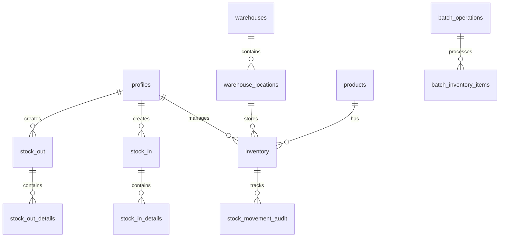

# Agile Warehouse Management System

A modern, real-time warehouse management system built with React, TypeScript, and Supabase.

## 🚀 Features

### User Roles & Permissions
- **Administrator**: Full system access, user management, and audit capabilities
- **Warehouse Manager**: Inventory management, stock operations, and batch processing
- **Field Operator**: Stock movement operations and inventory updates
- **Sales Operator**: Sales inquiry management and customer interactions

### Core Functionality
- Real-time inventory tracking
- Stock in/out operations with approval workflow
- Batch processing for bulk operations
- Barcode-based inventory management
- Audit trail for all inventory movements
- Multi-warehouse support with location tracking
- Role-based access control (RBAC)

## 🏗️ Architecture

### Frontend
- **Framework**: React with TypeScript
- **State Management**: React Query for server state
- **UI Components**: Custom components with responsive design
- **Real-time Updates**: Supabase real-time subscriptions
- **Routing**: React Router for navigation
- **Form Handling**: React Hook Form with validation

### Backend (Supabase)
- **Database**: PostgreSQL with Row Level Security
- **Authentication**: Supabase Auth
- **Real-time**: Supabase Realtime
- **Storage**: Supabase Storage for documents
- **API**: RESTful endpoints with RLS policies

### Database Schema


## 🛠️ Setup & Installation

### Prerequisites
- Node.js (v16 or higher)
- Docker Desktop
- Supabase CLI
- Git

### Local Development Setup
1. Clone the repository:
   ```bash
   git clone [repository-url]
   cd agile-warehouse-ui
   ```

2. Install dependencies:
   ```bash
   npm install
   ```

3. Set up environment variables:
   Create a `.env` file with:
   ```
   VITE_SUPABASE_URL=your_supabase_url
   VITE_SUPABASE_ANON_KEY=your_supabase_anon_key
   ```

4. Start local Supabase:
   ```bash
   supabase start
   ```

5. Apply database migrations:
   ```bash
   supabase db reset
   ```

6. Start the development server:
   ```bash
   npm run dev
   ```

## 📦 Database Schema Details

### Core Tables
- **profiles**: User profiles and roles
- **warehouses**: Warehouse information
- **warehouse_locations**: Storage locations within warehouses
- **products**: Product catalog
- **inventory**: Current stock levels
- **stock_in**: Stock receipt records
- **stock_in_details**: Stock receipt line items
- **stock_out**: Stock issue records
- **stock_out_details**: Stock issue line items

### Audit & Processing
- **stock_movement_audit**: Tracks all inventory changes
- **batch_operations**: Manages bulk operations
- **batch_inventory_items**: Links batch operations to inventory

### Security
- Row Level Security (RLS) policies for all tables
- Role-based access control
- Audit trail for all operations

## 🔄 Data Flow

### Stock In Process
1. Field Operator creates stock in record
2. Warehouse Manager reviews and approves
3. Inventory is updated automatically
4. Audit trail is created

### Stock Out Process
1. Field Operator creates stock out request
2. Warehouse Manager approves
3. Inventory is reduced
4. Audit record is created

### Batch Operations
1. Create batch operation
2. Add items to batch
3. Process batch
4. Update inventory automatically
5. Create audit records

## 🧪 Testing

### Frontend Testing
- Unit tests for components
- Integration tests for workflows
- E2E tests for critical paths

### Backend Testing
- Database function tests
- RLS policy tests
- Trigger tests

## 📚 API Documentation

### Authentication
- JWT-based authentication
- Role-based access control
- Session management

### Real-time Subscriptions
- Inventory updates
- Stock movement notifications
- Batch operation status

## 🔒 Security Features

- Row Level Security (RLS)
- Role-based access control
- Audit logging
- Input validation
- XSS protection
- CSRF protection

## 🚀 Deployment

### Frontend Deployment
- Build process
- Environment configuration
- CDN setup

### Backend Deployment
- Supabase project setup
- Database migrations
- Security policies

## 📝 Contributing

1. Fork the repository
2. Create a feature branch
3. Commit your changes
4. Push to the branch
5. Create a Pull Request

## 📄 License

This project is licensed under the MIT License - see the LICENSE file for details.

## 🤝 Support

For support, please open an issue in the repository or contact the development team.
